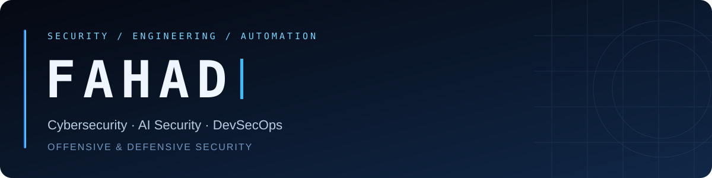
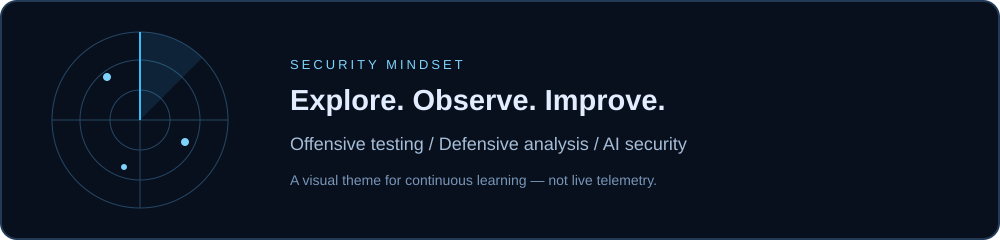

# Hi, I'm Fahad

**Cybersecurity · Offensive & Defensive Security · AI Security · DevSecOps**

I focus on offensive and defensive security, AI security, and DevSecOps. My work combines hands-on security labs with cloud deployment projects to understand how systems fail, how defenders detect those failures, and how engineering can prevent them.

I have completed cybersecurity coursework and am continuing my studies in DevOps, cloud infrastructure, and artificial intelligence. My direction spans red teaming and blue teaming, supported by Linux, networking, Python, and cloud automation.

## `~/security` — Security focus

| Area | Learning and project focus |
|---|---|
| Offensive security & red teaming | Web and network security testing, vulnerability analysis, Windows internals, and exploit fundamentals in isolated labs |
| Defensive security & blue teaming | Log analysis, detection engineering, incident investigation, and system hardening |
| SIEM & security analytics | ELK / Elastic Stack (Elasticsearch, Logstash, Kibana), centralized logs, event correlation, and threat-hunting workflows |
| Cloud security | AWS IAM, least-privilege access, network segmentation, cloud audit logs, secrets management, and misconfiguration review |
| Monitoring & observability | Grafana dashboards, Prometheus metrics, alerting, and using operational telemetry to support security investigations |
| Container & Kubernetes security | Image vulnerability assessment, workload permissions, secrets handling, and network policies |
| AI security & AI red teaming | Prompt injection, sensitive-data exposure, model and agent evaluations, and security boundaries in AI applications |
| DevOps & DevSecOps | Container delivery, cloud permissions, CI/CD security, and repeatable infrastructure workflows |

## `~/toolkit` — Technical stack & learning areas

**Cloud & containers**

**Security systems & observability**

**Automation & infrastructure**

**Security testing & AI security**

*Tools and frameworks for continued learning and lab exploration; demonstrated work is documented in the linked projects.*

**`~/offensive` — Offensive security**

**`~/ai-security` — AI security & red teaming**

Security frameworks

**`~/defensive` — Blue Team / DFIR · Learning roadmap**

**DevSecOps — Learning roadmap**

*Planned tools for future labs and projects; these badges do not indicate completed implementations.*

**Elastic Stack**

**AWS delivery & cloud security**

**Memory safety & programming foundations**

*Tools represented across projects and ongoing learning; the context for each area is listed below.*

| Domain | Technologies and topics | Context |
|---|---|---|
| Cloud & containers | AWS, Docker, Nginx, ECR, ECS Fargate, IAM | Public deployment project |
| CI/CD & automation | CodeBuild, CodePipeline, Git, Python, Bash | Project configuration and ongoing practice |
| Systems & networking | Linux, Windows, TCP/IP, DNS, HTTP, virtual machines | Cybersecurity foundations and lab practice |
| Offensive security | Kali Linux, Nmap, Netcat, Metasploit concepts, Immunity Debugger, memory safety | Current learning and isolated lab work |
| Defensive security | Log analysis, SIEM concepts, incident investigation, detection engineering, hardening | Security focus and continued development |
| SIEM & observability | Elasticsearch, Logstash, Kibana, Grafana, Prometheus | Learning and project focus |
| Cloud security | AWS IAM, CloudTrail, CloudWatch, VPC security, secrets management | Development focus; existing AWS project linked below |
| Infrastructure & orchestration | Kubernetes, Terraform, Ansible | Ongoing learning |
| AI & AI security | Machine learning foundations, LLM application security, prompt injection, model/agent evaluation | Ongoing study and planned evaluations |

## `~/learning` — Learning background

- **Completed:** cybersecurity coursework.
- **In progress:** DevOps, cloud infrastructure, and artificial intelligence coursework.
- **Applied practice:** security labs, cloud deployment configuration, and technical troubleshooting.

## `~/projects` — Featured project

### [Container deployment pipeline on AWS](https://github.com/FAHAD-s3do/docker-ecr-deployment)

A Docker/Nginx project with AWS deployment configuration and documented troubleshooting across ECR, ECS Fargate, CodeBuild, and CodePipeline.

**Explore the implementation:**

- [Docker image](https://github.com/FAHAD-s3do/docker-ecr-deployment/blob/main/Dockerfile) — container packaging for a static Nginx application.
- [Build configuration](https://github.com/FAHAD-s3do/docker-ecr-deployment/blob/main/buildspec.yml) — image build, ECR publishing, and deployment artifact generation.
- [ECS configuration](https://github.com/FAHAD-s3do/docker-ecr-deployment/tree/main/ecs-fargate-deployment) — task-definition template and local configuration renderer.
- [Troubleshooting notes](https://github.com/FAHAD-s3do/docker-ecr-deployment/tree/main/codepipeline-cd) — build-context errors, permissions, and container-name mismatches.

**Tools represented:** Docker, Nginx, AWS ECR, ECS Fargate, CodeBuild, CodePipeline, IAM, Python, and Git.

## `~/labs` — Security topics studied & ongoing practice

- **Web application security:** OWASP Top 10, vulnerability analysis, root causes, impact, and remediation.
- **AI & LLM security:** OWASP Top 10 for LLM Applications, prompt injection, sensitive-information disclosure, unsafe output handling, and excessive agency.
- **Network security & pivoting:** host discovery, service enumeration, routing, tunneling concepts, and access paths across segmented lab networks.
- **Linux & Windows privilege escalation:** permissions, security boundaries, misconfigurations, and local escalation concepts.
- **Linux & Windows kernel exploitation:** study of kernel vulnerabilities, user-mode versus kernel-mode boundaries, exploitation concepts, and mitigations.
- **Memory safety & binary analysis:** buffer overflows, stack behavior, crash analysis, registers, and debugger fundamentals.
- **Defensive analysis:** connecting vulnerability behavior to logs, detection opportunities, hardening, and remediation validation.
- **Security automation:** Python and shell scripting for repeatable testing, evidence collection, and analysis.

This section describes topics I have studied and areas of continued practice. Completed implementations and validated results are documented in the linked projects.

## `~/roadmap` — Next portfolio projects

- **Red + blue lab:** pair a controlled security test with observable logs, a detection, and remediation.
- **AI security evaluation:** create synthetic prompt-injection test cases and document expected versus observed behavior.
- **DevSecOps pipeline:** extend the container project with dependency/image checks, scoped permissions, and verification evidence.

These projects are planned; completed work will be linked here as it is published.

## `~/notes` — How I document my work

My goal for each project is a clear problem statement, reproducible setup, evidence of results, troubleshooting notes, and practical improvements.

Security testing is limited to my own lab environments and explicitly authorized systems.

## `~/activity` — Contribution activity

