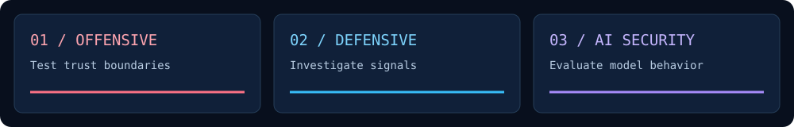

### Fahad · Security, AI & cloud engineering

I study offensive and defensive security, AI security, and DevSecOps through hands-on labs and cloud projects. My focus: understand failure modes, investigate evidence, and improve defenses.

### Selected toolkit

*Across projects and ongoing learning; tool-specific experience is documented in the linked work.*

### Selected work

| Work | What you will find |
|---|---|
| [AWS container delivery](https://github.com/FAHAD-s3do/docker-ecr-deployment) | Docker/Nginx, ECR, ECS and CI/CD configuration with troubleshooting |
| [Windows privilege escalation](labs/windows-privilege-escalation/README.md) | Reconstructed Meterpreter lab; reported SYSTEM identity, original evidence missing |
| [Security & applied AI lab collection](labs/README.md) | Six retrospective lab records with topic-specific animations; implementation evidence pending |

[Explore my technical focus and learning notes →](docs/security-learning.md)

Contribution activity

