# Web Application Pentesting

> **Status: retrospective activity record — implementation evidence pending.**
> The author reports performing this lab. The supplied platform session history records a launched environment; it does not independently verify completion or results. Original lab content, scripts and screenshots have not been supplied.

## Available record

| Field | Recorded information |
|---|---|
| Source title | Web application pentesting & e... |
| Session date(s) | 2026-09-27–2026-09-28 |
| Topic indicated by title | Web application security assessment |
| Implementation / results | Not available for review |

Dates are transcribed from the supplied history; its timezone is not confirmed. Repeated launches are treated as sessions of the same lab, not additional completed projects. Infrastructure identifiers are omitted.

## Objective and tools

The topic above is inferred from the visible title. Exact objectives, tools, versions and configuration are unconfirmed; the truncated title has not been expanded into an invented full title.

## Evidence to recover

Full lab title, target scope, tools, vulnerability findings, reproduction notes and remediation evidence.

## Next documentation step

Recover one finding with its root cause, impact, supporting evidence and a validated fix.

## Results and troubleshooting

No findings, success metrics, bugs fixed or mitigations tested can be substantiated from the available record. This page is not a completed implementation or a reproducible tutorial.

[Back to lab index](../README.md)
