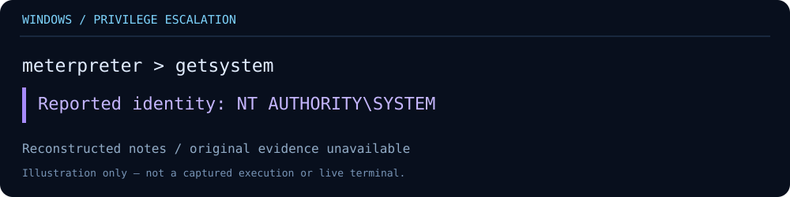

# Windows Privilege Escalation with Meterpreter

> **Status: reconstructed lab notes.** This write-up was reconstructed from the author's recollection. Original commands, screenshots and session logs were not retained. No fresh execution was performed when preparing this document.

## Objectives

Study Windows session identity and an attempt to obtain local SYSTEM privileges from an existing Meterpreter session.

## Tools used

The initial access method, starting account and token privileges are unknown.

## Reconstructed sequence

| Stage | Recalled or reconstructed activity | Evidence status |
|---|---|---|
| Existing session | A Meterpreter session was available on a Windows lab target | Author recollection; initial access not documented |
| Identity inspection | `getuid` was discussed as part of the remembered workflow | Original pre-elevation identity unavailable |
| Elevation attempt | Author confirms using `getsystem` | Exact success message and technique unavailable |
| Result | Author reports `NT AUTHORITY\SYSTEM` after the attempt | User-reported result; no retained transcript |

These are notes about a past exercise, not a reproducible exploit recipe or a terminal transcript. The animation is illustrative.

## What the result means

SYSTEM is a highly privileged local Windows identity. The recalled result does not establish the starting privilege level, an unprivileged-to-SYSTEM exploit, domain administrator access, or kernel exploitation.

Rapid7 documents `getsystem` as an attempt to obtain SYSTEM privileges; success depends on the session and environment. The specific technique used in this exercise cannot be established from the available recollection.

## Key skills covered

- Distinguishing a session's identity from the method that created the session.
- Understanding local Windows privilege levels.
- Using before-and-after identity checks to evaluate an elevation attempt.
- Separating recalled outcomes from independently verifiable evidence.

## Troubleshooting log

No specific failures, fixes or outdated commands could be recovered. None are claimed here. `local_exploit_suggester` was discussed during reconstruction, but its execution is unconfirmed and is not presented as a completed lab step.

## Evidence needed for a repeat lab

- Windows build and architecture; Metasploit version.
- Starting account, token privileges and initial session context.
- Timestamped before-and-after identity output.
- Full success/failure message identifying the attempted technique.
- Relevant host telemetry, with sensitive information removed.

A future repeat should be performed only in an owned or explicitly authorized lab. Keep original evidence alongside the write-up.

## Defensive follow-up — not performed in the original record

For a future repeat, collect process and service telemetry around the attempt, identify which elevation method actually ran, and test a relevant hardening measure. Do not attribute a particular event or detection to this exercise without logs.

## References

- [Rapid7: Meterpreter getsystem](https://docs.rapid7.com/metasploit/meterpreter-getsystem)
- [Rapid7: Manage Meterpreter and shell sessions](https://docs.rapid7.com/metasploit/manage-meterpreter-and-shell-sessions/)
