# Linux Threat Hunter



**Read-only Linux triage • Python standard library • JSON + HTML reports**

A small defensive tool that collects process, socket and persistence-configuration context and summarizes SSH failed-password messages. It produces explainable investigation leads with explicit collection coverage rather than a blanket “safe” or “infected” verdict.

> **Fresh implementation:** built for this portfolio, not recovered code from an earlier lab. The bundled example is synthetic. This is a learning project, not an EDR, forensic acquisition tool or production incident-response platform.

## Quick start

Requires Python **3.10+**. No pip dependencies. Live collection requires Linux; `ss` from iproute2 is optional for socket inventory. Missing tools and unreadable sources are reported rather than silently treated as clean.

```bash
# From this project directory
python3 --version
command -v ss
python3 threat_hunter.py --demo --output reports-demo
python3 threat_hunter.py --output reports-live
```

Open `report.html` from the output directory in a browser, or process `report.json` with your own scripts. Each run requires a **new output directory** to avoid overwriting evidence.

```bash
python3 threat_hunter.py --auth-log /path/to/exported-auth.log --ssh-threshold 10 --output reports-auth
python3 -m unittest discover -s tests -v
```

Run as your normal user first. Additional privileges increase visibility but are not automatically requested. The tool never installs packages, kills processes, disables services, scans remote hosts or performs remediation. It writes only its report directory.

## Checks and interpretation

| Rule | Input | What triggers it | Important limitation |
|---|---|---|---|
| `PROC_TEMP` | `/proc/PID/exe` | Executable path under `/tmp`, `/var/tmp`, `/dev/shm` | Temporary executables may be legitimate |
| `PROC_DELETED` | `/proc/PID/exe` | Deleted executable marker | Package updates can cause this |
| `NET_WILDCARD` | `ss -H -lntu` | Wildcard listening TCP or bound UDP address | Does not prove Internet exposure; firewall and namespace matter |
| `PERSIST_TEMP_REFERENCE` | Selected cron/systemd files | Active line references a temporary directory | Presence does not prove execution, persistence or enabled state |
| `SSH_REPEATED_FAILURE` | Text log tail | Failed-password count per IP reaches threshold | Sample count, not a rate; no time-window or success correlation |

Priorities are heuristic triage hints, not calibrated risk scores. No findings does not establish that a host is clean.

## Collection scope

- **Processes:** executable links only, up to 10,000 PIDs. No environment variables or full command lines are collected. Exited processes, kernel threads and permission restrictions may create partial coverage.
- **Sockets:** TCP listeners and bound UDP endpoints in the current network namespace. No process-to-socket correlation.
- **Persistence:** selected system cron directories, cron spool and systemd configuration roots; up to 2,000 files, at most 1 MiB each. Symlinks are skipped. User units, login scripts and some crontabs are not covered. Inventory includes file paths and hashes, not raw configuration.
- **SSH:** last 1 MiB of an explicit log, `/var/log/auth.log`, or `/var/log/secure`. Only matching sshd failed-password lines are counted. Journald and rotated logs are not queried; formats may differ by distribution.

The host can change during collection. A compromised host can tamper with `/proc`, logs or command output. This tool does not provide trusted offline acquisition or complete coverage.

## Report contract

`report.json` contains `version`, `generated_at` (UTC), `mode`, `coverage`, `inventory` and `findings`. Each finding provides a rule ID, severity, subject, evidence summary and recommended next step. Coverage statuses are `ok`, `partial`, `unavailable`, or `synthetic`.

HTML output escapes untrusted values and uses no JavaScript or remote assets. On Unix, newly created output directories use mode `0700` and report files use `0600`. Paths, executable names and source IPs can still be sensitive: review and redact real reports before sharing. Only synthetic output is committed here.

## Example

[View synthetic JSON](examples/synthetic-demo/report.json) · [Download/open synthetic HTML](examples/synthetic-demo/report.html)

The demo generates five leads from invented fixtures: a temporary executable, a deleted executable, a wildcard socket, repeated failed passwords from a documentation-range address and a temporary-path configuration reference. These are examples, not discoveries on a real target.

## Validation

- **9 automated tests passed** on Python 3.12.14: rule boundaries, IPv4/IPv6 endpoints, threshold handling, invalid inputs, missing dependencies/logs, configuration comments, HTML escaping and overwrite refusal.
- **Synthetic CLI run passed:** generated JSON and HTML with five expected leads.
- **Live smoke run in a restricted Linux container passed:** process and persistence coverage were partial, sockets available, SSH log unavailable. No host inventory or live output is published.
- No multi-distribution, root-level, detection-accuracy or real incident validation has been performed.

## Design and next steps

Functions separate collection, rule evaluation and rendering so rules can be tested without scanning a host. Future work: journald support, time-windowed SSH correlation, user-level persistence coverage, allowlists and distribution fixtures. These are planned, not implemented.

## Skills demonstrated

Linux telemetry collection, defensive Python automation, explainable heuristics, graceful handling of incomplete evidence, structured reporting and regression testing.
